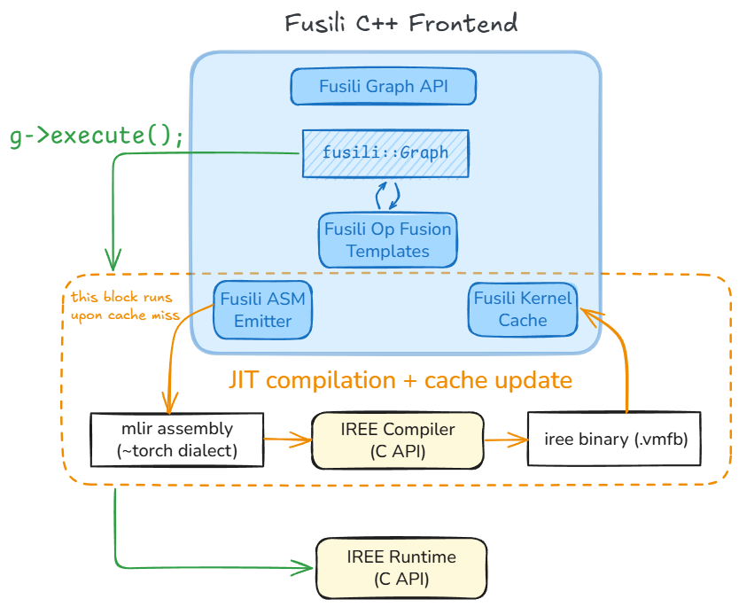

# SharkFuser (aka Fusili)

Fusili is a C++ Graph API and Frontend to expose cuDNN-like primitives backed by IREE code-generated kernels.




## Developer Guide:

### Build and test:
```shell
cmake -GNinja -S. -Bbuild \
    -DCMAKE_C_COMPILER=clang -DCMAKE_CXX_COMPILER=clang++ \
    -DCMAKE_LINKER_TYPE=LLD
cmake --build build --target all
ctest --test-dir build
```

To re-run failed tests verbosely:
```shell
ctest --test-dir build --rerun-failed --output-on-failure
```

### Code coverage:

This works with gcc builds (clang support is future work).

To generate code coverage metrics:
```shell
cmake -GNinja -S. -Bbuild
cmake --build build --target all
ctest --test-dir build -T test -T coverage
```

This generates the `*.gcda` and `*.gcno` files with coverage info. At this point one may use an IDE to visualize the coverage info inlayed with the source code. If using the gcov-viewer extension in VSCode: Hit `Cmd+Shift+P` -> Gcov Viewer: Reload (Import gcda files).

To generate an HTML (interactive) coverage report:
```shell
lcov --capture --directory build --output-file build/coverage.info
lcov --remove build/coverage.info 'build/*' '/usr/*' --output-file build/coverage.info
genhtml build/coverage.info --output-directory coverage_report
```

### Lint

Run clang-format:
```shell
find . -path ./build -prune -o \( -type f \( -name "*.cpp" -o -name "*.h" \) -print \) | xargs clang-format -i
```

Debugging:
Enable logging (TODO)

Create a fusili graph:
TODO


Project Roadmap:
- [x] Build/test infra, logging
- [x] Graph, tensor, node datastructures and builder API
- [x] Code coverage testing
- [ ] conv_fprop MLIR ASM emitter
- [ ] IREE compiler integration
- [ ] IREE runtime integration
- [ ] `g->execute()` (calls IREE compiler/runtime C API)
- [ ] conv_fprop integration testing
- [ ] Kernel cache
- [ ] Elementwise ops (relu?)
- [ ] Op fusion templates
- [ ] Python bindings
- [ ] Shape inference for static dims
- [ ] Serialization
- [ ] hipDNN integration
